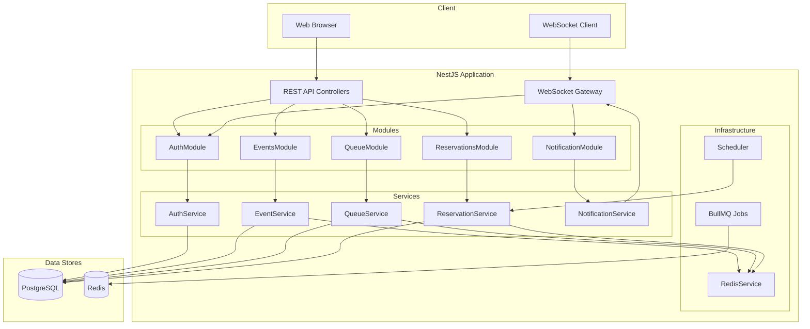
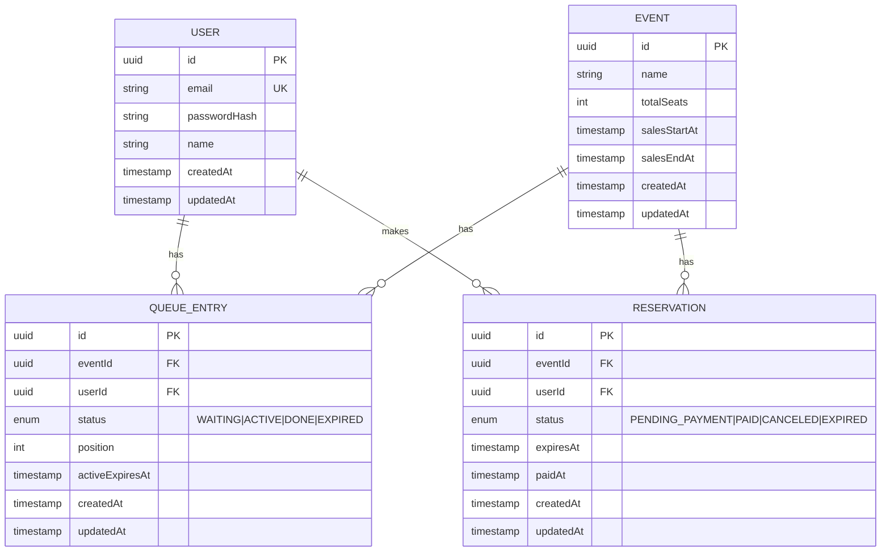
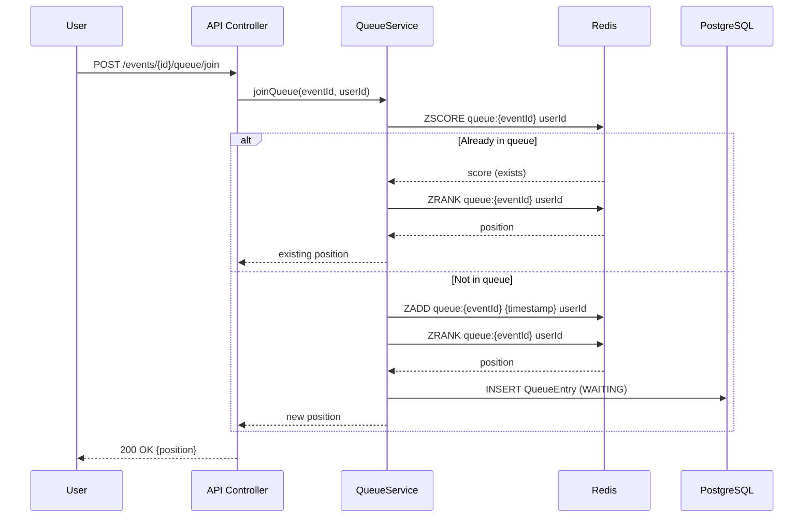
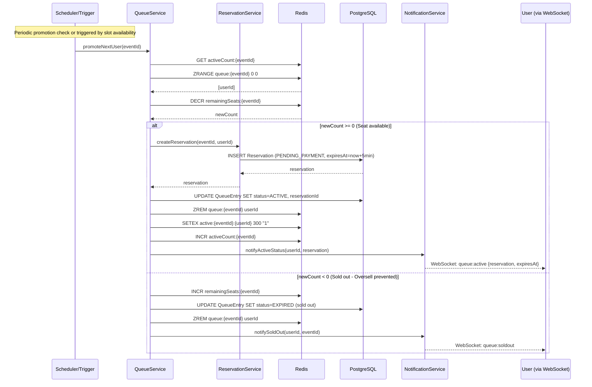
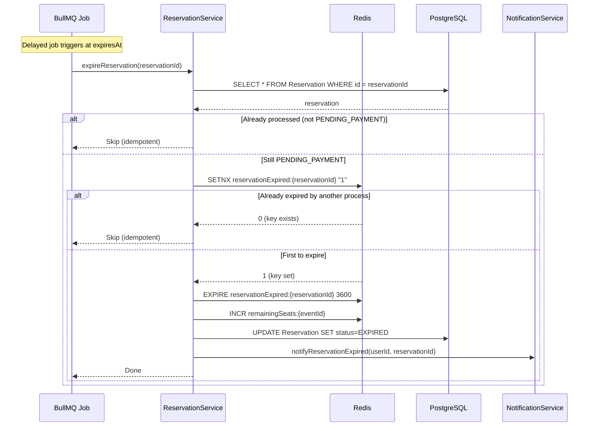

# Design Document

## Overview

Nest Ticket Queue는 NestJS 기반의 선착순 티켓팅 시스템으로, Redis를 활용한 원자적 좌석 관리와 대기열 처리를 통해 동시성 환경에서도 오버셀이 발생하지 않도록 설계되었습니다.

핵심 설계 원칙:

- **정합성 우선**: 성능보다 데이터 정합성을 우선시
- **원자적 연산**: Redis DECR/INCR을 통한 좌석 카운터 관리
- **멱등성**: 만료 처리 등 중복 실행에도 안전한 설계
- **실시간 알림**: WebSocket을 통한 상태 변경 즉시 전달

## Architecture



### Layer Architecture

```
┌─────────────────────────────────────────────────────────────┐
│                    Presentation Layer                        │
│  ┌─────────────┐  ┌─────────────┐  ┌─────────────────────┐  │
│  │ Controllers │  │   Guards    │  │  WebSocket Gateway  │  │
│  └─────────────┘  └─────────────┘  └─────────────────────┘  │
├─────────────────────────────────────────────────────────────┤
│                    Application Layer                         │
│  ┌─────────────┐  ┌─────────────┐  ┌─────────────────────┐  │
│  │  Services   │  │    DTOs     │  │    Interceptors     │  │
│  └─────────────┘  └─────────────┘  └─────────────────────┘  │
├─────────────────────────────────────────────────────────────┤
│                      Domain Layer                            │
│  ┌─────────────┐  ┌─────────────┐  ┌─────────────────────┐  │
│  │  Entities   │  │   Enums     │  │   Domain Logic      │  │
│  └─────────────┘  └─────────────┘  └─────────────────────┘  │
├─────────────────────────────────────────────────────────────┤
│                   Infrastructure Layer                       │
│  ┌─────────────┐  ┌─────────────┐  ┌─────────────────────┐  │
│  │ Repositories│  │ RedisService│  │   BullMQ Queues     │  │
│  └─────────────┘  └─────────────┘  └─────────────────────┘  │
└─────────────────────────────────────────────────────────────┘
```

## Components and Interfaces

### Module Structure

```
src/
├── app.module.ts
├── main.ts
├── common/
│   ├── decorators/
│   │   └── current-user.decorator.ts
│   ├── guards/
│   │   └── jwt-auth.guard.ts
│   ├── interceptors/
│   │   └── logging.interceptor.ts
│   └── filters/
│       └── http-exception.filter.ts
├── auth/
│   ├── auth.module.ts
│   ├── auth.controller.ts
│   ├── auth.service.ts
│   ├── strategies/
│   │   └── jwt.strategy.ts
│   └── dto/
│       ├── login.dto.ts
│       └── auth-response.dto.ts
├── events/
│   ├── events.module.ts
│   ├── events.controller.ts
│   ├── events.service.ts
│   ├── entities/
│   │   └── event.entity.ts
│   └── dto/
│       ├── create-event.dto.ts
│       └── event-response.dto.ts
├── queue/
│   ├── queue.module.ts
│   ├── queue.controller.ts
│   ├── queue.service.ts
│   ├── entities/
│   │   └── queue-entry.entity.ts
│   ├── dto/
│   │   ├── join-queue.dto.ts
│   │   └── queue-status.dto.ts
│   └── processors/
│       └── queue-promotion.processor.ts
├── reservations/
│   ├── reservations.module.ts
│   ├── reservations.controller.ts
│   ├── reservations.service.ts
│   ├── entities/
│   │   └── reservation.entity.ts
│   ├── dto/
│   │   ├── create-reservation.dto.ts
│   │   └── reservation-response.dto.ts
│   └── processors/
│       └── reservation-expiration.processor.ts
├── notification/
│   ├── notification.module.ts
│   ├── notification.gateway.ts
│   └── notification.service.ts
├── redis/
│   ├── redis.module.ts
│   └── redis.service.ts
└── users/
    ├── users.module.ts
    ├── users.service.ts
    └── entities/
        └── user.entity.ts
```

### Key Interfaces

```typescript
// Queue Service Interface
interface IQueueService {
  joinQueue(eventId: string, userId: string): Promise<QueuePosition>;
  getPosition(eventId: string, userId: string): Promise<QueueStatus>;
  promoteNextUsers(eventId: string, count: number): Promise<string[]>;
  expireActiveUser(eventId: string, userId: string): Promise<void>;
}

// Reservation Service Interface
interface IReservationService {
  createReservation(eventId: string, userId: string): Promise<Reservation>;
  processPayment(reservationId: string, userId: string): Promise<Reservation>;
  expireReservation(reservationId: string): Promise<void>;
}

// Redis Service Interface
interface IRedisService {
  // Seat inventory operations
  initializeSeats(eventId: string, count: number): Promise<void>;
  decrementSeats(eventId: string): Promise<number>;
  incrementSeats(eventId: string): Promise<number>;
  getRemainingSeats(eventId: string): Promise<number>;

  // Queue operations
  addToQueue(eventId: string, userId: string): Promise<number>;
  getQueuePosition(eventId: string, userId: string): Promise<number>;
  getQueueLength(eventId: string): Promise<number>;
  removeFromQueue(eventId: string, userId: string): Promise<void>;

  // Active user management
  setActiveUser(
    eventId: string,
    userId: string,
    ttlSeconds: number
  ): Promise<void>;
  isActiveUser(eventId: string, userId: string): Promise<boolean>;
  removeActiveUser(eventId: string, userId: string): Promise<void>;
}

// Notification Service Interface
interface INotificationService {
  notifyQueuePosition(userId: string, eventId: string, position: number): void;
  notifyActiveStatus(userId: string, eventId: string, expiresAt: Date): void;
  notifyReservationCreated(userId: string, reservation: Reservation): void;
  notifyReservationExpired(userId: string, reservationId: string): void;
  notifyPaymentSuccess(userId: string, reservationId: string): void;
}
```

## Data Models

### Entity Relationship Diagram



### Redis Key Structure

```
# Seat Inventory (String - Counter)
remainingSeats:{eventId}          # Value: integer count
                                  # Example: remainingSeats:evt-123 = 50

# Queue (Sorted Set - for position tracking)
queue:{eventId}                   # Score: timestamp, Member: userId
                                  # Allows O(log N) position lookup

# Active Users (Set with TTL per user)
active:{eventId}:{userId}         # Value: "1", TTL: 300 seconds
                                  # Existence check = is user active?

# Active Users Count (for limiting concurrent active users)
activeCount:{eventId}             # Value: integer count

# Reservation Expiration Tracking (for idempotency)
reservationExpired:{reservationId}  # Value: "1", TTL: 1 hour
                                    # Prevents duplicate seat restoration
```

### Enums

```typescript
enum QueueEntryStatus {
  WAITING = "WAITING",
  ACTIVE = "ACTIVE",
  DONE = "DONE",
  EXPIRED = "EXPIRED",
}

enum ReservationStatus {
  PENDING_PAYMENT = "PENDING_PAYMENT",
  PAID = "PAID",
  CANCELED = "CANCELED",
  EXPIRED = "EXPIRED",
}
```

## Sequence Diagrams

### Queue Join Flow



### Queue Promotion with Reservation Creation (Critical Path)

Note: In this simplified design, reservation is created automatically during ACTIVE promotion. The single 5-minute timer starts at promotion time and covers the entire payment window.



### Reservation Expiration Flow



## Correctness Properties

_A property is a characteristic or behavior that should hold true across all valid executions of a system-essentially, a formal statement about what the system should do. Properties serve as the bridge between human-readable specifications and machine-verifiable correctness guarantees._

Based on the acceptance criteria analysis, the following correctness properties must be verified through property-based testing:

### Property 1: Event Creation Initializes Redis Counter

_For any_ valid event creation request with totalSeats = N, after the event is created, the Redis counter `remainingSeats:{eventId}` SHALL equal N.

**Validates: Requirements 1.4**

### Property 2: Queue Join Idempotency

_For any_ user U and event E, if U joins the queue for E multiple times, the queue length SHALL increase by exactly 1 (on first join only), and all subsequent join calls SHALL return the same position.

**Validates: Requirements 2.2**

### Property 3: Sales Period Enforcement

_For any_ event E with salesStartAt and salesEndAt, and any timestamp T:

- If T < salesStartAt, queue join SHALL be rejected
- If T > salesEndAt, queue join SHALL be rejected
- If salesStartAt <= T <= salesEndAt, queue join SHALL be accepted

**Validates: Requirements 2.3, 2.4**

### Property 4: Queue Promotion FIFO Order

_For any_ queue with users [U1, U2, ..., Un] who joined in that order, when K users are promoted to ACTIVE, the promoted users SHALL be exactly [U1, U2, ..., Uk] in that order.

**Validates: Requirements 4.1**

### Property 5: ACTIVE Status TTL Enforcement

_For any_ user promoted to ACTIVE status at time T, their ACTIVE status SHALL expire at time T + 5 minutes if no reservation is made.

**Validates: Requirements 4.2, 4.4**

### Property 6: Reservation Seat Decrement Atomicity (Oversell Prevention)

_For any_ event E with remainingSeats = N and M concurrent reservation attempts where M > N:

- Exactly N reservations SHALL succeed
- Exactly (M - N) reservations SHALL fail with "sold out"
- The final remainingSeats SHALL equal 0 (not negative)

**Validates: Requirements 5.1, 5.2, 5.3, 12.1**

### Property 7: Non-ACTIVE User Reservation Rejection

_For any_ user U with queue status != ACTIVE attempting to create a reservation, the request SHALL be rejected with 403 Forbidden.

**Validates: Requirements 5.4**

### Property 8: Reservation Expiration Idempotency

_For any_ reservation R that expires, regardless of how many times the expiration process runs (including concurrent executions), the seat counter SHALL be incremented exactly once.

**Validates: Requirements 7.2, 7.3, 12.2**

### Property 9: Concurrent Last-Seat Reservation

_For any_ event E with remainingSeats = 1 and N concurrent ACTIVE users attempting reservation simultaneously:

- Exactly 1 reservation SHALL succeed
- Exactly (N - 1) reservations SHALL fail
- remainingSeats SHALL equal 0 after all attempts complete

**Validates: Requirements 12.1**

### Property 10: Domain Object Serialization Round-Trip

_For any_ domain object (Event, QueueEntry, Reservation), serializing to JSON and deserializing back SHALL produce an equivalent object.

**Validates: Requirements 11.3**

### Property 11: JWT Authentication Correctness

_For any_ JWT token:

- If the token is valid and not expired, authentication SHALL succeed and return the correct user ID
- If the token is invalid or expired, authentication SHALL fail with 401 Unauthorized

**Validates: Requirements 9.2, 9.3**

## Error Handling

### Error Response Format

```typescript
interface ErrorResponse {
  statusCode: number;
  message: string;
  error: string;
  timestamp: string;
  path: string;
}
```

### Error Categories

| Error Type          | HTTP Status | Description                               |
| ------------------- | ----------- | ----------------------------------------- |
| ValidationError     | 400         | Invalid request body or parameters        |
| UnauthorizedError   | 401         | Missing or invalid JWT token              |
| ForbiddenError      | 403         | User not in ACTIVE status for reservation |
| NotFoundError       | 404         | Resource not found                        |
| ConflictError       | 409         | Sold out / Already in queue               |
| InternalServerError | 500         | Unexpected server error                   |

### Critical Error Scenarios

1. **Sold Out (Oversell Prevention)**

   - When: DECR returns negative value
   - Action: INCR to restore, return 409 Conflict
   - Message: "Event is sold out"

2. **Not Active Status**

   - When: User attempts reservation without ACTIVE status
   - Action: Return 403 Forbidden
   - Message: "You must be in ACTIVE status to make a reservation"

3. **Reservation Expired**

   - When: Payment attempted after expiresAt
   - Action: Return 400 Bad Request
   - Message: "Reservation has expired"

4. **Sales Period Violation**
   - When: Queue join outside sales period
   - Action: Return 400 Bad Request
   - Message: "Sales have not started yet" or "Sales have ended"

## Testing Strategy

### Testing Framework

- **Unit Testing**: Jest with @nestjs/testing
- **Property-Based Testing**: fast-check (TypeScript PBT library)
- **Integration Testing**: Jest with supertest for API testing
- **E2E Testing**: Jest with actual Redis and PostgreSQL (via Docker)

### Dual Testing Approach

Unit tests and property-based tests are complementary:

- **Unit tests** verify specific examples, edge cases, and error conditions
- **Property tests** verify universal properties that should hold across all inputs

### Property-Based Testing Configuration

```typescript
// fast-check configuration
import * as fc from "fast-check";

// Run minimum 100 iterations per property
fc.configureGlobal({ numRuns: 100 });
```

### Test Categories

#### 1. Unit Tests

- Service method behavior with mocked dependencies
- DTO validation
- Guard logic
- Error handling

#### 2. Property-Based Tests

Each correctness property from the design document MUST be implemented as a property-based test:

```typescript
// Example: Property 6 - Oversell Prevention
// **Feature: nest-ticket-queue, Property 6: Reservation Seat Decrement Atomicity**
describe("Reservation Seat Decrement Atomicity", () => {
  it("should never oversell seats", async () => {
    await fc.assert(
      fc.asyncProperty(
        fc.integer({ min: 1, max: 100 }), // totalSeats
        fc.integer({ min: 1, max: 200 }), // concurrentAttempts
        async (totalSeats, attempts) => {
          // Setup event with totalSeats
          // Execute concurrent reservation attempts
          // Assert: successful reservations <= totalSeats
          // Assert: remainingSeats >= 0
        }
      )
    );
  });
});
```

#### 3. Integration Tests

- Full API flow testing with real Redis
- WebSocket connection and event delivery
- BullMQ job processing

### Test File Structure

```
test/
├── unit/
│   ├── events/
│   │   └── events.service.spec.ts
│   ├── queue/
│   │   └── queue.service.spec.ts
│   ├── reservations/
│   │   └── reservations.service.spec.ts
│   └── auth/
│       └── auth.service.spec.ts
├── property/
│   ├── oversell-prevention.property.spec.ts
│   ├── queue-idempotency.property.spec.ts
│   ├── expiration-idempotency.property.spec.ts
│   └── serialization-roundtrip.property.spec.ts
├── integration/
│   ├── events.integration.spec.ts
│   ├── queue.integration.spec.ts
│   └── reservations.integration.spec.ts
└── e2e/
    └── ticketing-flow.e2e.spec.ts
```

### Critical Test Scenarios

1. **Concurrent Last-Seat Test**

   - Setup: Event with 1 remaining seat
   - Action: 10 concurrent reservation requests
   - Assert: Exactly 1 success, 9 failures, remainingSeats = 0

2. **Expiration Idempotency Test**

   - Setup: Expired reservation
   - Action: Trigger expiration 3 times concurrently
   - Assert: Seat restored exactly once

3. **Queue FIFO Test**
   - Setup: 10 users join queue in order
   - Action: Promote 5 users
   - Assert: First 5 users are promoted in join order

### Test Annotations

All property-based tests MUST include the following comment format:

```typescript
// **Feature: nest-ticket-queue, Property {number}: {property_text}**
// **Validates: Requirements {X.Y}**
```
